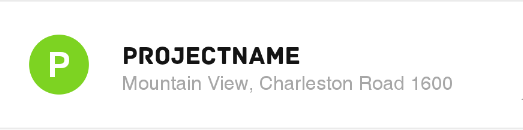

# Android Coding Challenge
The following exercises should help us to better assess your skills. We have created an example project that already contains some code. 
Please fork the repository to an own private repository and solve following problems.

Your code should be clean, efficient and tested.

In doubt, keep it simple!

 What do you need?
* [GithHub](https://github.com/) Account
* Current version of Android Studio 4+ und Gradle

**The Exercises do not have to be solved in the given order**

## Exercise 1

After opening the app a login-screen appears. In this screen there is a login-button whereby the user can access the app.

The screen is developed for a Pixel 2XL display. Please refactor the Layout so that the app can also be used on other devices like Pixel 6, Samsung S21.

context-package: package de.mycraftnote.code_challenge.ui.login.*

## Exercise 2
Create a project list in the ProjectListFragment. A single list item should look like this:

* Where the first character from the project-name is displayed in circle;
* The first line is the name of the project, the second line is the full address and can be ignored if the response doesn't contain one;
* The list for this task should only contain Folders, not Projects and sorted after creationDate;
* Clicking on a project should show a snackbar with a localized lastOpenedDate. Something like: Project last opened on: Wed, Mar 31, '21.

Keep in mind that the timestamps are in seconds, not milliseconds. You can ignore the attributes that are not required for this task.
While there is no restriction on which libraries one can use, please prefer the Android Architecture Components where possible.

endpoint: https://europe-west1-craftnote-development.cloudfunctions.net/api/v1/projects

api key: c322f488-05e7-4f4a-a2b3-41a4f31af501

you can find the documentation for the endpoint [here](https://bitbucket.org/Craftnote/api-doc/).

context-package: de.mycraftnote.code_challenge.ui.task.projects.*